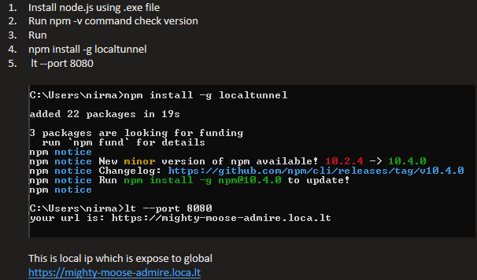

PAYMENT MICROSERVICE
1. Implementing Payment Gateway

    Expose yourself to the world
    Localtunnel allows you to easily share a web service on your local development machine without messing with DNS and firewall settings.
    
    Localtunnel will assign you a unique publicly accessible url that will proxy all requests to your locally running webserver.
    
    Quickstart
    Install Localtunnel globally (requires NodeJS) to make it accessible anywhere:
    
    npm install -g localtunnel
    Start a webserver on some local port (eg http://localhost:8000) and use the command line interface to request a tunnel to your local server:
    
    lt --port 8080
    You will receive a url, for example https://flkajsfljas.loca.lt, that you can share with anyone for as long as your local instance of lt remains active. Any requests will be routed to your local service at the specified port

