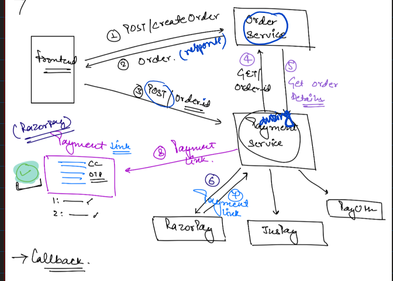
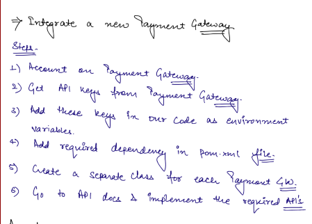
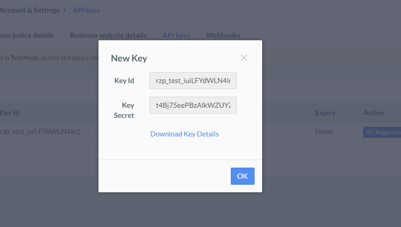
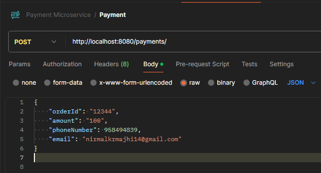
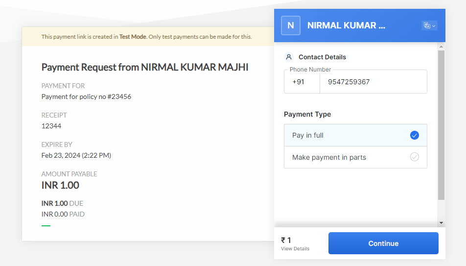
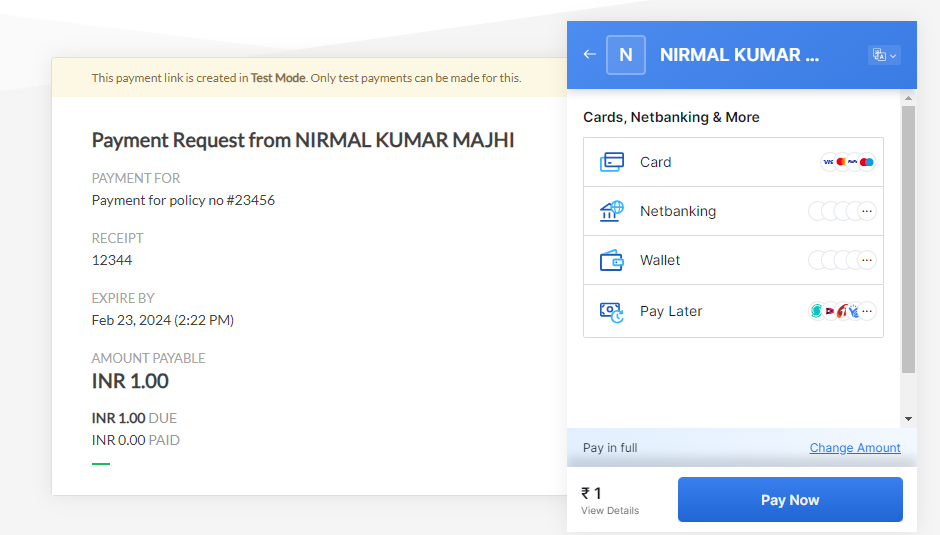
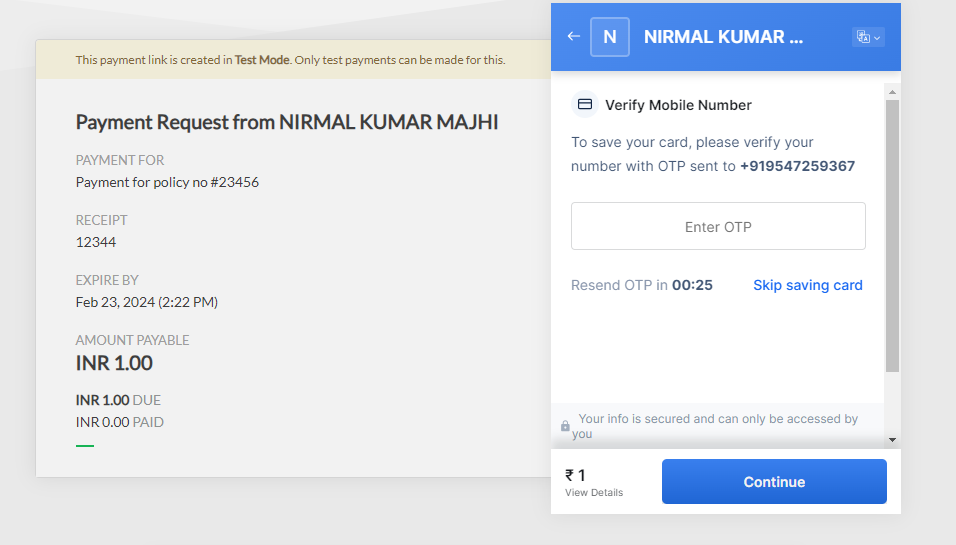
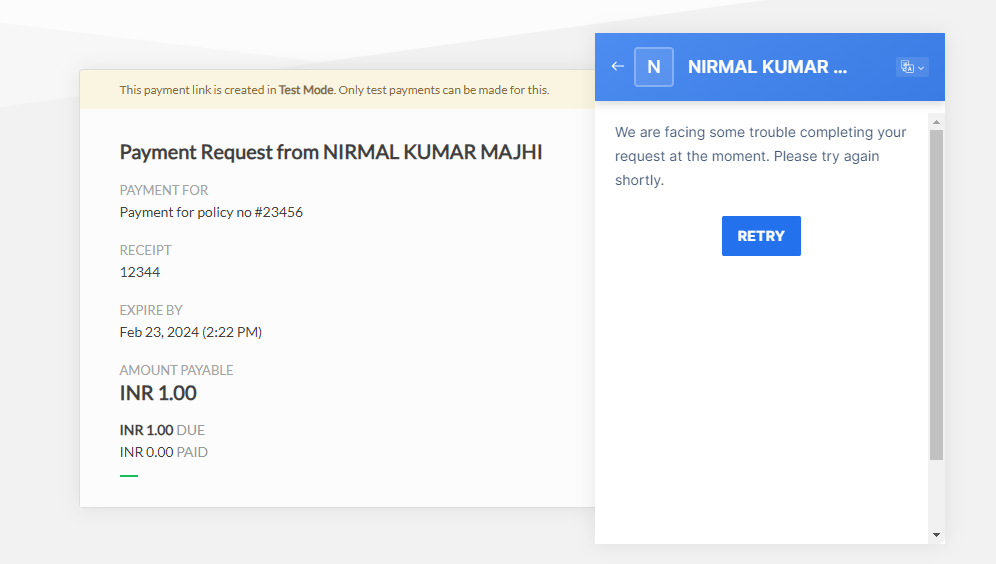
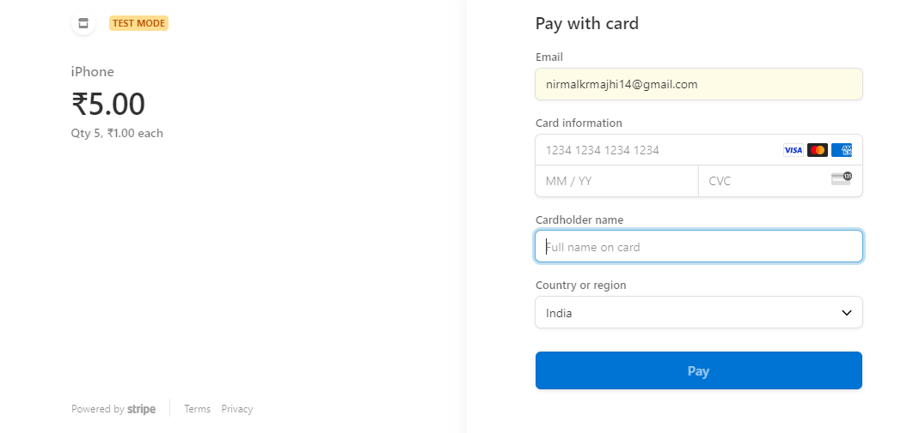

PAYMENT MICROSERVICE
1. Implementing Payment Gateway

    Expose yourself to the world
    Localtunnel allows you to easily share a web service on your local development machine without messing with DNS and firewall settings.
    
    Localtunnel will assign you a unique publicly accessible url that will proxy all requests to your locally running webserver.
    
    Quickstart
    Install Localtunnel globally (requires NodeJS) to make it accessible anywhere:
    
    npm install -g localtunnel
    Start a webserver on some local port (eg http://localhost:8000) and use the command line interface to request a tunnel to your local server:
    
    lt --port 8080
    You will receive a url, for example https://flkajsfljas.loca.lt, that you can share with anyone for as long as your local instance of lt remains active. Any requests will be routed to your local service at the specified port

1. [x] Implementing Payment Gateway 2 (Implementing Search: Paging & Sorting)
   1. 
   2. Steps to integrate the Razor pay Api or Any third party api
   2. PUT THE DEPENDENCY OF razorpay and then 
   2.  we have to create a account with basic details
   3.  then generate the test key and password
   4.  key = rzp_test_iuiLFYdWLN4ln1 
   5.  password = t4Bj75eePBzAIkWZUYZNz5Go
 
   
     6. take those values and put them in application.properties files
      but not directly , they should be put inside environment variables of the ide
      as they are secrete key for us
    7. now we will copy the code that is provide in our razorpaypamentgateway class
   so that we will get the variables that need to consider we will call the api
    8. now set up postman with variable details like below
           
    

    9. now hit postman and we will get the below response with short urls

             {
             "cancelled_at": 0,
             "reminders": [],
             "amount_paid": 0,
             "notes": {
             "policy_name": "Jeevan Bima"
             },
             "reference_id": "12344",
             "payments": null,
             "created_at": 1708674897,
             "description": "Payment for policy no #23456",
             "expired_at": 0,
             "notify": {
             "whatsapp": false,
             "sms": true,
             "email": true
             },
             "short_url": "https://rzp.io/i/GOXpgSEw8C",
             "callback_url": "https://example-callback-url.com/",
             "updated_at": 1708674897,
             "upi_link": false,
             "accept_partial": true,
             "currency": "INR",
             "id": "plink_NeFIyjIvH4ZQsP",
             "callback_method": "get",
             "expire_by": 1708678345,
             "first_min_partial_amount": 100,
             "whatsapp_link": false,
             "amount": 100,
             "reminder_enable": true,
             "user_id": "",
             "customer": {
             "contact": "Gaurav Kumar",
             "name": "958494839",
             "email": "nirmalkrmajhi14@gmail.com"
             },
             "status": "created"
             }

  10. now goto short url and make payment as showing in the ss
      
      
   11. use this testing card details
       Mastercard	Domestic	5267 3181 8797 5449
       

      

   12. The price objectt of stripe is 

           {
           "id": "price_1MoBy5LkdIwHu7ixZhnattbh",
           "object": "price",
           "active": true,
           "billing_scheme": "per_unit",
           "created": 1679431181,
           "currency": "usd",
           "custom_unit_amount": null,
           "livemode": false,
           "lookup_key": null,
           "metadata": {},
           "nickname": null,
           "product": "prod_NZKdYqrwEYx6iK",
           "recurring": {
           "aggregate_usage": null,
           "interval": "month",
           "interval_count": 1,
           "trial_period_days": null,
           "usage_type": "licensed"
           },
           "tax_behavior": "unspecified",
           "tiers_mode": null,
           "transform_quantity": null,
           "type": "recurring",
           "unit_amount": 1000,
           "unit_amount_decimal": "1000"
           }
       13. https://docs.stripe.com/api/prices/object
       14. https://buy.stripe.com/test_fZedU97v72LQaoU185
       14. 